# QR Code

A customizable QR code generator to create beautiful and unique QR codes.

<div style="display:flex; flex-direction:row; flex-wrap:wrap; justify-content:center; gap:8px;">
    <a href="https://esteetey.dev"></a>
    <a href="https://www.padlet.com"></a>
    <a href="https://www.uilicious.com">
    
    </a>
    <a href="https://www.supabase.com"></a>
    <a href="https://www.vercel.com"></a>
    <a href="https://viteconf.org/"></a>
</div>

## Features

- ✅ Accessible: minimally WCAG A compliant
- 🎨 Customizable colors and styles
- 🖼️ Export to SVG and PNG
- 📋 Copy to clipboard
- 🌓 Light/dark/system-preference mode toggle
- 🎲 Randomize style button
- 🌐 Available in 29+ languages thanks to [deepl-translate-github-action](https://github.com/lyqht/deepl-translate-github-action)
- 💾 Save & Load QR Code config
- 🖼️ Upload custom image for logo
- 🎭 Presets: Pre-crafted QR code styles
- 🛡️ Error correction level: affects the size of the QR code and logo within. Use lower correction levels for bigger pieces of data to ensure that it can be read.
- 📦 Batch data export: Import a CSV file with multiple data strings and export QR codes for them all at once.

## Self-hosting with Docker 🐋

Mini-QR can easily be self-hosted. We provide a [docker-compose.yml](docker-compose.yml) file as well as our own images. We are using GitHub's `ghrc.io` Container Registry.

```bash
git clone https://gitlab.com/actcmsvn/qr-code.git

cd qr-code

docker compose up -d
```